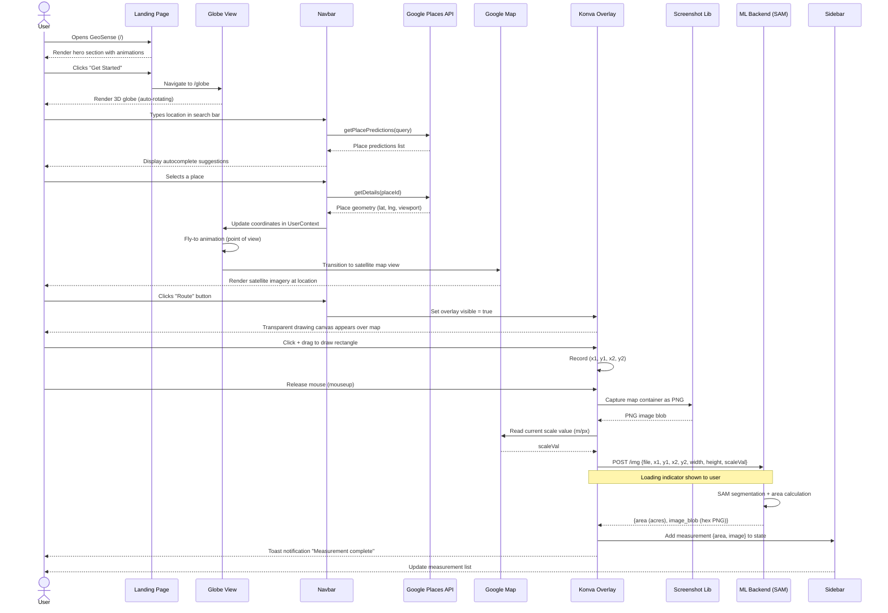
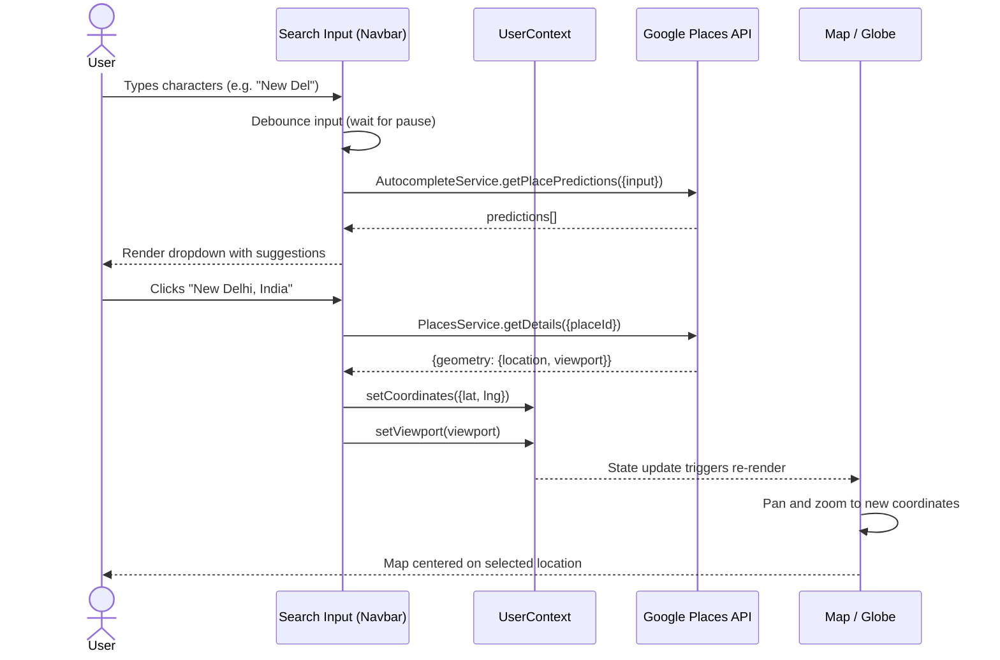
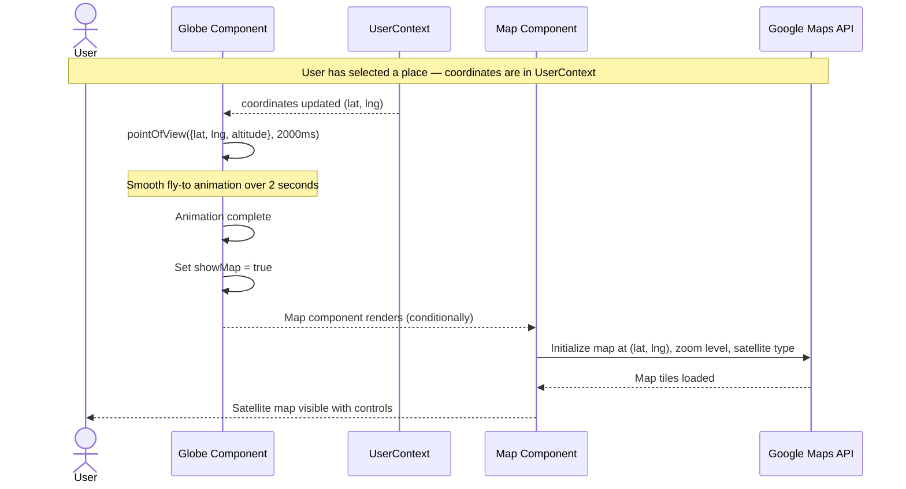
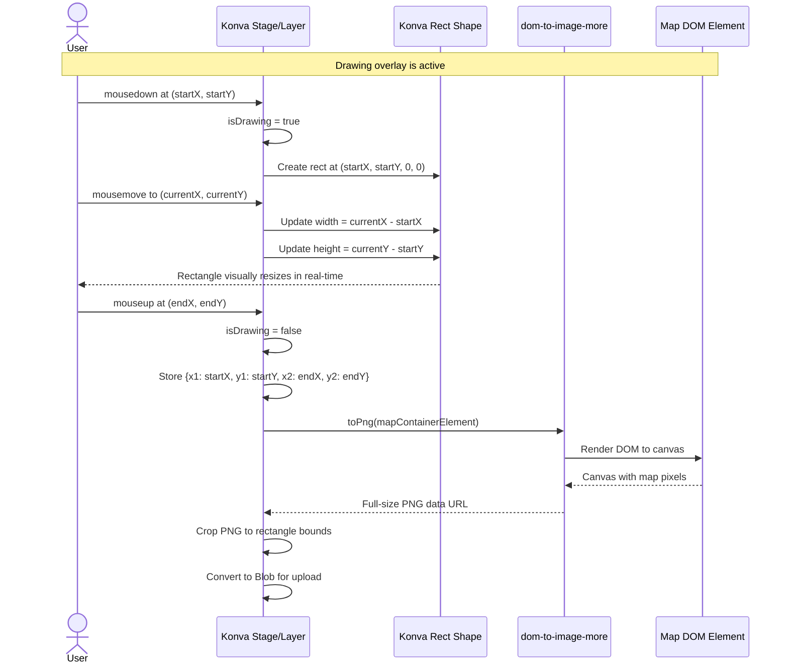
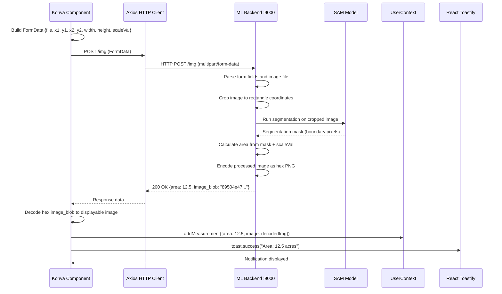
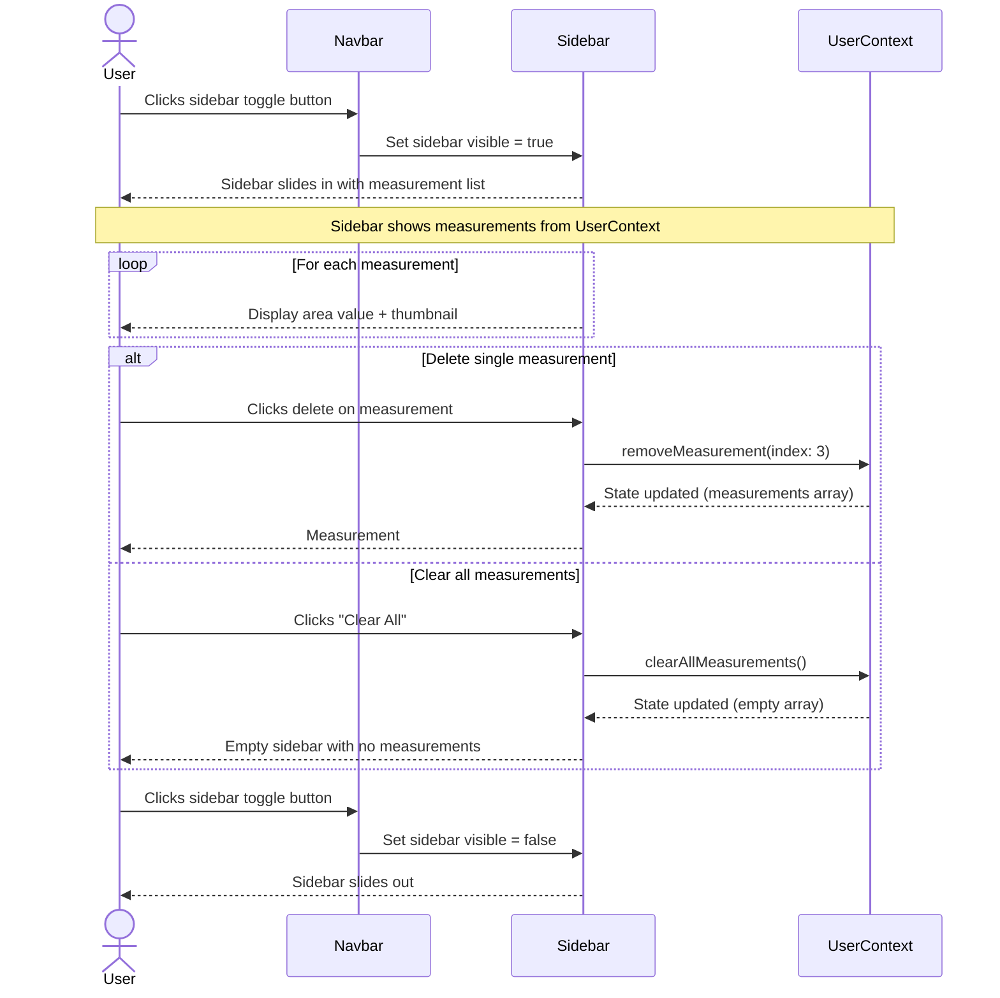
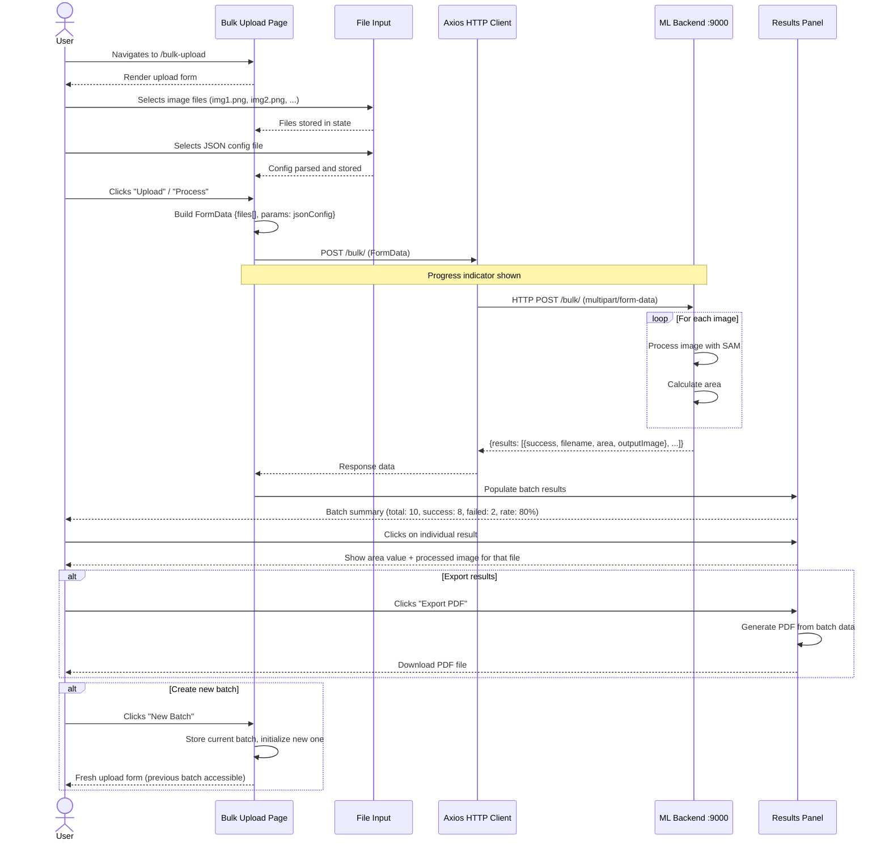
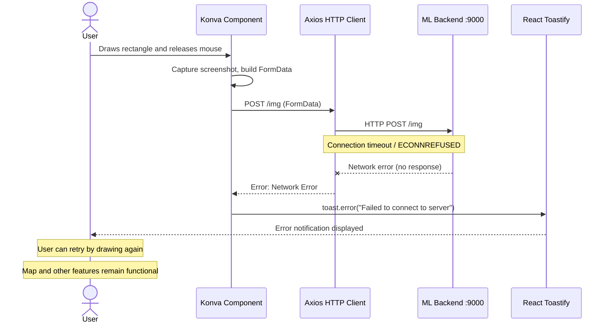

# Sequence Diagrams

## GeoSense — Geospatial Land Measurement Platform

---

## Table of Contents

1. [Single Area Measurement (End-to-End)](#1-single-area-measurement-end-to-end)
2. [Place Search with Autocomplete](#2-place-search-with-autocomplete)
3. [Globe-to-Map Transition](#3-globe-to-map-transition)
4. [Rectangle Drawing and Screenshot Capture](#4-rectangle-drawing-and-screenshot-capture)
5. [Area Computation (Backend Interaction)](#5-area-computation-backend-interaction)
6. [Measurement History Management](#6-measurement-history-management)
7. [Bulk Image Upload and Processing](#7-bulk-image-upload-and-processing)
8. [Error Handling — Backend Unavailable](#8-error-handling--backend-unavailable)

---

## 1. Single Area Measurement (End-to-End)

This is the primary workflow covering a full measurement from landing to result.

---

## 2. Place Search with Autocomplete

Detailed interaction for the search functionality.

---

## 3. Globe-to-Map Transition

The animated transition when a user selects a place from the globe view.

---

## 4. Rectangle Drawing and Screenshot Capture

The drawing interaction and subsequent screenshot process.

---

## 5. Area Computation (Backend Interaction)

The API call and response handling.

---

## 6. Measurement History Management

Sidebar interactions for viewing and managing measurements.

---

## 7. Bulk Image Upload and Processing

The complete bulk upload workflow.

---

## 8. Error Handling — Backend Unavailable

Behavior when the ML backend is unreachable.

---

## Diagram Legend

| Symbol    | Meaning                                          |
|-----------|--------------------------------------------------|
| `->>`     | Synchronous request / function call              |
| `-->>` | Response / return value                          |
| `--x`     | Failed request / error                           |
| `Note`    | Explanatory annotation                           |
| `loop`    | Repeated action                                  |
| `alt`     | Alternative flows (if/else)                      |
| `actor`   | Human user                                       |
| `participant` | System component or external service         |
